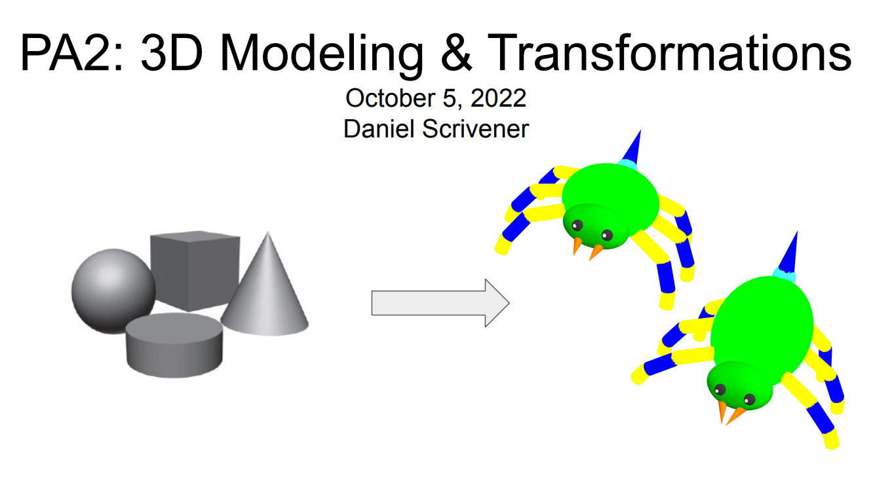
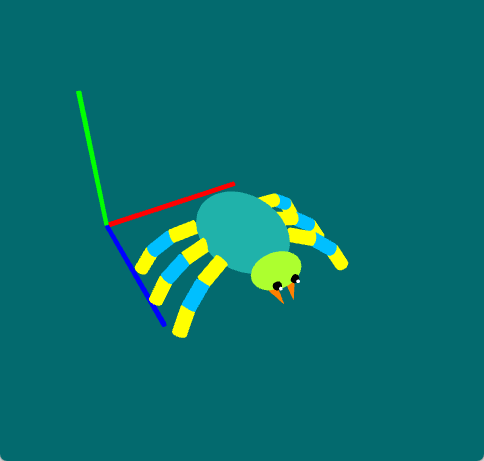

## Info
Name: Pengchao Yuan (U50962567)  
Collaborators: Ge Gao  
Assignment: CS680, PA2  
Reference: PA2 slides   
Demo:  

## Implementations
- todo1: matrix order: pre-rotation -> rotation -> post-rotation -> scale -> translate -> parent  
- todo2&3: Designed a spider creature using `Sphere`, `Cylinder`, `Cone`. Stored every component in `componentList` and `componentDict`. Created in `InitGL()`   
Potential Error: default z-length of `Cylinder` is 2, which means child offer need double.
- todo4: Defined the rotation range for each joint by `setRotateExtent()`  
- todo5: Created new keyboard behavior. 's': showing angle for each component, helps to designed pose and copy parameter. 'p': switch pose in preset pose list, stored in Pose.py. Preset pose stored rotation angle for each axis  
Defined `action` list of components group for multi-select, each group contains components and corresponding rotation factor. Stored selected group in `self.select_obj_index`. Need extra type check for `WXK_RETURN`, `WXK_UP`, `WXK_DOWN`, `WXK_LEFT` and `WXK_RIGHT` events when using `self.select_obj_index`
- todo6&7: For simplicity, treat eye position as origin point, eye direction is z-axis. Then calculate the angle between eye and cursor position (from `unprojectCanvas()`).